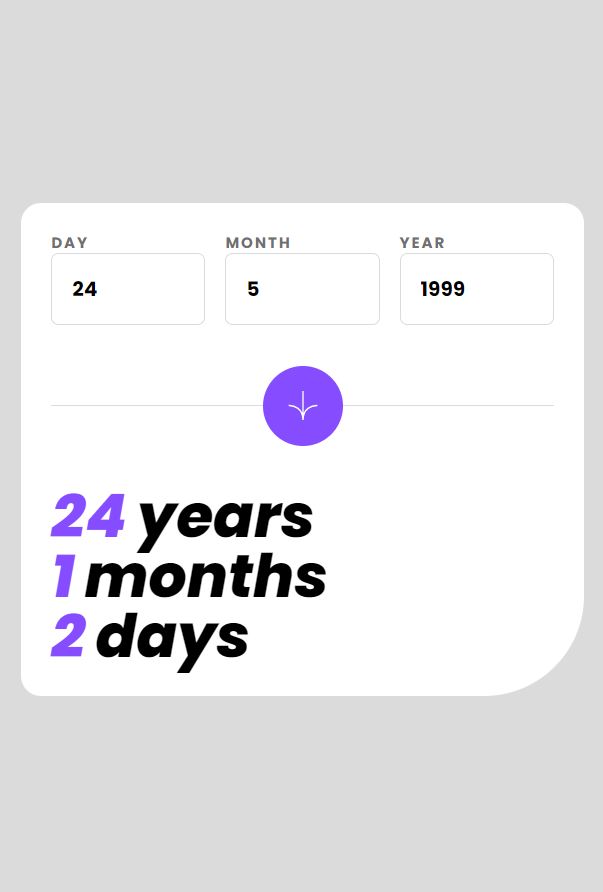
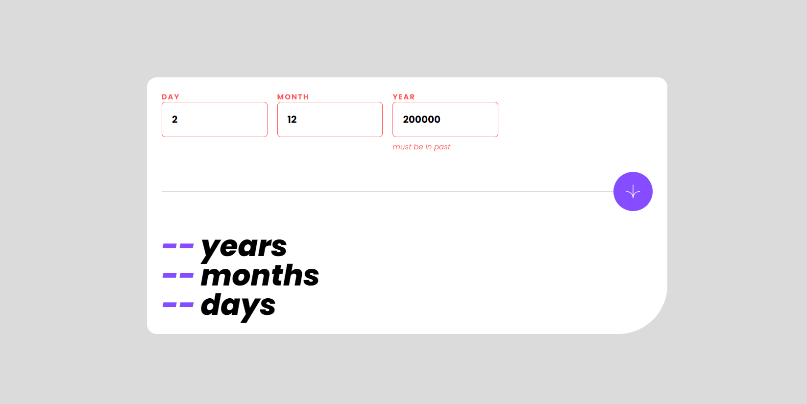

## Overview

### Screenshot




### Links

- Live Site Preview : https://bright-sherbet-a434be.netlify.app/

## My process

### Built with

- Image assets belongs to [frontendmentor.io](https://www.frontendmentor.io/challenges/interactive-rating-component-koxpeBUmI)
- [Tailwindcss](https://tailwindcss.com/) - CSS Framework
- [React](https://reactjs.org/) - JS library

# Created using vite

[viteJs](https://vitejs.dev/)

```
  npm install
  npm run dev
```
